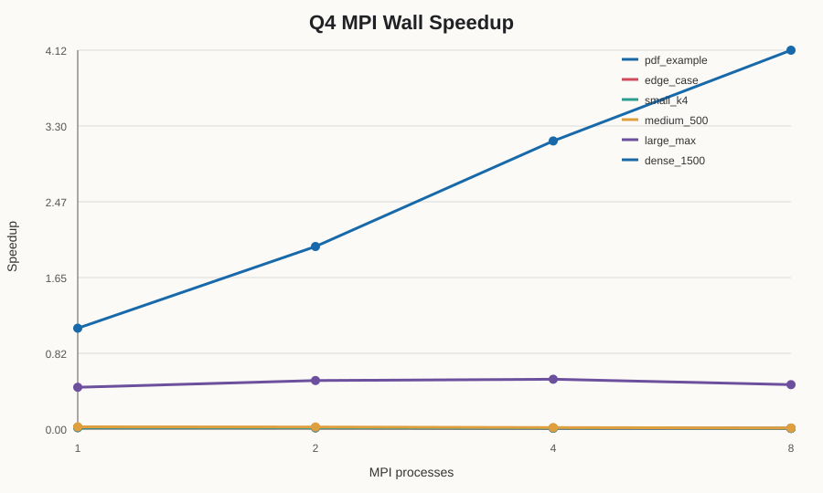
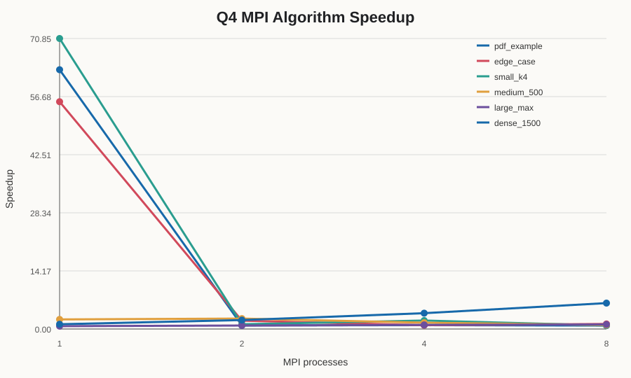
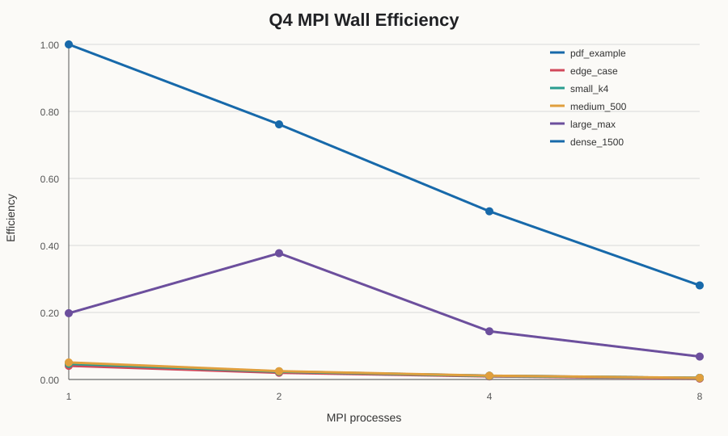
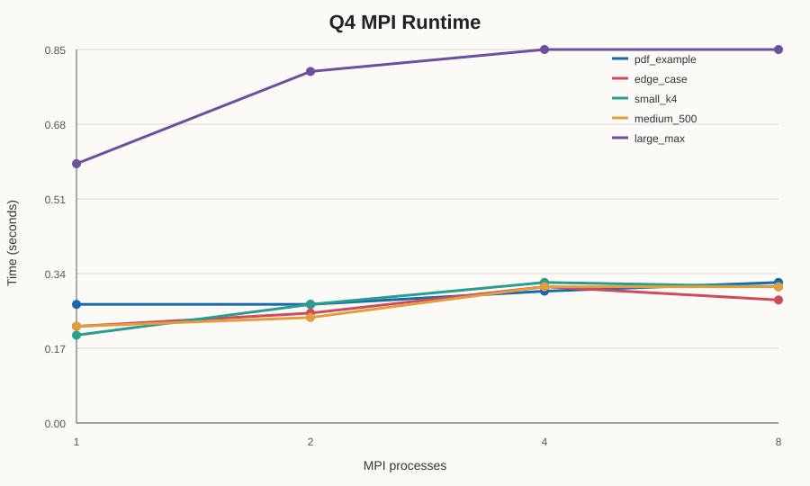

# HW2 Report

## Q3: Bitonic Sort

- Problem description
- Sequential vs. parallel timing results
- Speed-up table
- Efficiency and observations

## Q4: Triangle Counting

### Problem

The Q4 program counts triangles in an undirected graph. The graph edges are divided between MPI processes. The program uses vertex degree and vertex ID to orient the edges, so one triangle is counted only once.

### Results

The benchmark uses 1, 2, 4, and 8 MPI processes. It records both whole-launcher wall time and internal algorithm time. The internal MPI timing separates setup/I/O, degree broadcast, adjacency broadcast, edge scatter, local compute, and final reduction. Tiny cases use repeated runs. The benchmark produced 24 rows, and all process counts gave the same answer for each graph.

| Graph | Vertices | Edges | Triangles |
| --- | ---: | ---: | ---: |
| PDF sample | 4 | 5 | 2 |
| Edge case | 3 | 3 | 1 |
| Small K4 | 4 | 6 | 4 |
| Medium | 500 | 5,000 | 1,284 |
| Large maximum | 100,000 | 1,000,000 | 1,300 |
| Dense | 1,500 | 1,000,000 | 395,056,429 |

The following table shows the best measured values for each graph. Wall time includes process launch and MPI startup. Algorithm time is the sum of the measured MPI setup, communication, computation, and reduction phases.

| Graph | Sequential (s) | Fastest wall MPI (P, s) | Best wall speedup | Best algorithm speedup |
| --- | ---: | ---: | ---: | ---: |
| PDF sample | 0.015746 | 1, 0.332328 | 0.047382 | 4.448372 |
| Edge case | 0.013517 | 1, 0.333538 | 0.040527 | 14.119329 |
| Small K4 | 0.015532 | 1, 0.335448 | 0.046302 | 5.769235 |
| Medium | 0.016707 | 1, 0.328635 | 0.050837 | 5.157691 |
| Large maximum | 0.579336 | 2, 0.770264 | 0.752127 | 1.372756 |
| Dense | 3.059672 | 8, 1.365551 | 2.240614 | 3.057074 |

### Observations

Small graph wall time is dominated by MPI process spawning, MPI initialization, and finalization rather than triangle computation. Sequential times are about 0.014-0.016 seconds, while the fastest MPI wall times are about 0.329-0.335 seconds. Algorithm-only speedup is more useful for comparing internal computation and communication, although very small timings remain sensitive to measurement noise.

For `large_max`, the sequential time was 0.579 seconds. The best wall result was P=2 at 0.770 seconds, giving a speedup of 0.752. At P=8, the largest algorithm phase was setup/I/O and the initial broadcast at 0.510252 seconds. The adjacency broadcast took 0.123202 seconds, while local compute took only 0.000456 seconds. Therefore, startup and replicated-data communication, together with launcher overhead, are responsible for the poor scaling.

The current implementation broadcasts the complete oriented graph to every rank. This is simple and makes local intersections easy, but it uses more communication and memory than a truly partitioned-storage design in which each machine stores an equal-sized subset and exchanges required neighbor data.

The dense case has 1,500 vertices and 1,000,000 edges, about 89% of all possible undirected edges. It counted 395,056,429 triangles and took 3.060 seconds sequentially. This exercises the forward-counting algorithm near its O(E^1.5) worst-case behavior. Its best wall speedup was 2.241 at P=8, and its best algorithm speedup was 3.057 at P=8.

## Q8: Weather Data Parallelization

- Problem description
- Sequential vs. MPI timing results
- Speed-up table
- Efficiency and observations
- Correctness checks

## Conclusion

The Q4 correctness tests passed for all graph sizes and process counts. The benchmark also shows that parallel execution is not always faster. For this input size, communication and MPI startup overhead are important bottlenecks. A larger graph or a more computation-heavy triangle counting method may be needed to see better scaling.
